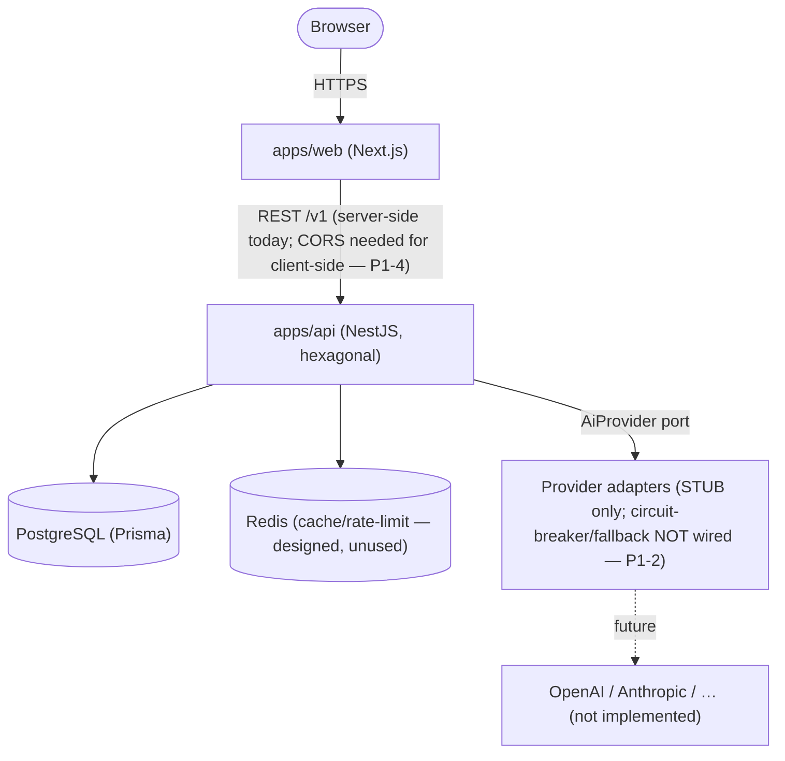
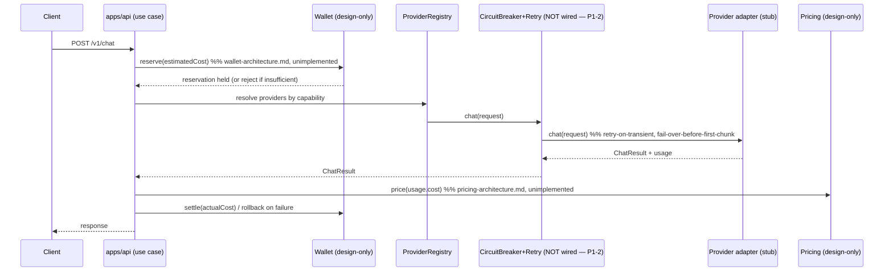

# 01 — Final Architecture Audit

**Auditor stance:** adversarial. The goal was to break the architecture, not bless it. Every finding below was verified against the actual source/config files (commands run against the working tree), not against the documentation — because a recurring failure mode found here is that the documentation asserts things the code does not do.

**Date:** 2026-07-12
**Commit state at audit time:** `Platform/` is **entirely untracked** — `git ls-files Platform/` returns 0 files. Nothing has been committed. "Everything builds" is true only on this working tree.

---

## 0. Scope correction: the validation chain in the brief does not match this repository

The brief asks to validate `Constitution → Blueprint → Capability Layer → Product Blueprint → DDD → …`. Three of those artifacts **do not exist** in this repository: there is no Platform "Blueprint," no "Capability Layer" document, and no "Product Blueprint."

More importantly, the one that does exist — `00_System/AIFA_CONSTITUTION.md` — **governs AIFA Content Studio, a deliberately separate workstream**, not this Platform (locked in `DECISIONS.md` D-011, and the Platform's existence is D-020 / ADR-0001). The Platform does not derive from the Constitution's content principles; it derives from the *separation decision*. Validating Platform code "against the Constitution" is therefore a category error. The correct top of the Platform's derivation chain is **D-020 → ADR-0001 → ADR-0002…0013**. That chain *is* internally consistent (verified: all 13 ADRs cross-reference correctly and none contradict another).

This is not a defect in the repository — it is a defect in the audit brief's mental model, and I am flagging it rather than fabricating an alignment that doesn't apply.

---

## 1. P0 — Production blockers (foundation integrity)

### P0-1 — CI does not run. The workflow is in a location GitHub Actions never scans.
`ci.yml` lives at `Platform/.github/workflows/ci.yml`. GitHub Actions **only discovers workflows in `.github/workflows/` at the repository root**. There is no root `.github/workflows/` (verified: `ls .github/workflows` → does not exist). Therefore:
- CI has **never run and will never run** as currently placed.
- Every claim in `PROGRESS_REPORT.md`, `ci-cd-pipeline.md`, and `CONTRIBUTING.md` that "CI runs lint/typecheck/test/build" or that `main` is protected by a passing check is **false in practice**.
- The same root-location rule breaks `Platform/.github/pull_request_template.md` and `Platform/.github/ISSUE_TEMPLATE/*` — GitHub reads those only from the repo root too, so none of them will ever appear.

The entire quality-gate story is currently inoperative. This is the single most important finding: a foundation whose value is "another team can build on this safely" has no enforcement mechanism actually wired to the platform it runs on.

### P0-2 — The lockfile is not committed; frozen-lockfile installs will fail everywhere.
`pnpm-lock.yaml` exists on disk (182 KB) but is **not tracked by git**. Both Dockerfiles and the CI workflow run `pnpm install --frozen-lockfile`, which **fails immediately if the lockfile is absent from the checkout**. So:
- Reproducible builds are not currently guaranteed.
- The moment CI is relocated (P0-1) it will fail on the install step unless the lockfile is committed in the same change.
- `turbo prune --docker` emits a pruned lockfile *derived from the committed root lockfile* — with no committed root lockfile, the Docker build path is also broken.

Fix is trivial (commit the lockfile) but it must happen, and it must be verified in the first real CI run.

---

## 2. P1 — Major architecture issues

### P1-1 — Documentation asserts files and behaviors that do not exist.
This is the most damaging class of issue for a "build without redesign" foundation, because it actively misleads the next team.

- `api-architecture.md` (§auth) and `api-standards.md` (§auth flow) both state that `application/ports/auth-guard.port.ts` **"exists as a seam" / is "already present in apps/api."** It **does not exist**. The only ports present are `clock.port.ts` and `provider-health-source.port.ts` (verified via `ls`).
- `packages/database/README.md` states `AiProviderConfig` is **"consumed via apps/api's ProviderRegistryAdapter."** It is **never read by any code** (verified: the only references are type re-exports and the README itself). `ProviderRegistryAdapter` ignores the table entirely.

A missing doc is a gap; a doc that confidently describes a non-existent seam is a trap. A new engineer will grep for `auth-guard.port.ts`, not find it, and lose trust in every other "already present" claim.

### P1-2 — The flagship resilience layer is orphaned. ADR-0005's core guarantee is unexercised by any running code.
`CircuitBreaker` and `FallbackChain` — the mechanism behind "provider failure must not break the application" — are **never instantiated anywhere in `apps/api`** (verified: zero references in `apps/api/src`). They exist only as unit-tested library classes. Meanwhile the one registry bootstrap, `provider-registry.adapter.ts`, does this:

```ts
this.registry.register(new StubAdapter('stub-primary'));
this.registry.register(new StubAdapter('stub-secondary'));
```

Two consequences:
1. **The "no provider hardcoded / config-driven" claim (ADR-0005, the platform's differentiator) is contradicted by its only implementation.** Providers are hardcoded in a constructor; `AiProviderConfig` is not consulted.
2. **No request path ever passes through a circuit breaker or fallback chain.** The resilience guarantee is proven in isolation and wired into nothing. "It works" for the health endpoint tells you nothing about whether failover works in `apps/api`.

This is acceptable *only* if labeled as such. It is currently labeled the opposite (docs present it as the working heart of the system).

### P1-3 — Health/readiness is misrepresented and, as written, is unsafe for orchestration.
`api-architecture.md` and `monitoring-observability.md` state readiness is "backed by `@nestjs/terminus`" and checks "DB / Redis / provider-registry reachability." Verified reality:
- `@nestjs/terminus` is a declared dependency **never imported** in `src/`.
- `/v1/health/ready` checks **neither Postgres nor Redis** — it hand-rolls a check over the two stub providers only.

Because readiness ignores the datastore, an instance with a **dead database would report `ready` and receive production traffic**. For a system whose readiness probe is the contract an orchestrator uses to route requests, this is a correctness defect, not a cosmetic one.

### P1-4 — No CORS, but the architecture is intentionally two-origin.
`apps/web` (`:3000`) and `apps/api` (`:3001`) are separate origins by design. `main.ts` never calls `app.enableCors()` (verified). Today only the server-side Next route handler (`/api/health`) reaches the API, so nothing visibly breaks. The moment the documented plan — client-side data fetching from `apps/web` — is implemented, **every browser call to the API is blocked by the same-origin policy**. CORS is also a trust-boundary decision (which origins may call the API with credentials) that must be designed deliberately, not discovered at first integration.

### P1-5 — The readiness path live-calls every provider on every request. This is a cost/scale defect baked into the hot path.
`GetSystemHealthUseCase.execute()` → `providerHealthSource.checkAll()` → `Promise.all(providers.map(p => p.healthCheck()))` — a **live** health call to every provider on **every** `/v1/health/ready` hit. With real providers (network calls) and an orchestrator probing readiness every few seconds across N replicas, this produces continuous outbound provider traffic — real money and real rate-limit consumption for a health check. `ai-provider-layer.md` itself says health should be **cached** (circuit-breaker state as the cache). The implementation does the opposite. This will not surface with stubs; it will surface on day one of a real provider integration.

---

## 3. P2 — Improvements (fix before large development)

- **P2-1 — No `ValidationPipe`.** `class-validator`/`class-transformer` are dependencies that currently do nothing; `main.ts` registers no global pipe. Request-body validation (an API-correctness *and* security control) is unwired. `api-standards.md` describes DTO validation as if active.
- **P2-2 — The "only `@aifa/config` reads `process.env`" rule is already violated in app code.** `apps/web/src/app/api/health/route.ts` reads `process.env.NEXT_PUBLIC_API_BASE_URL` directly. Separately, `apps/web` depends on `@aifa/config` and `@aifa/logger` but uses neither in application code — a declared-but-unused coupling.
- **P2-3 — Prisma is never disconnected.** No `OnModuleDestroy`/`$disconnect`, no `app.enableShutdownHooks()` (verified). Managed Postgres tolerates dropped connections, but rolling deploys at scale should drain cleanly; wire this before real DB use.
- **P2-4 — Circuit breaker half-open admits unlimited concurrent trials.** In `half-open`, the guard only rejects when `state === 'open'`, so every concurrent request during the half-open window hits the provider. The doc and test describe "a trial request" (singular). Classic half-open gates to a single probe. Minor, but it means a flapping provider gets hammered by a burst the instant its cooldown expires.
- **P2-5 — Logging is not integrated into DI.** There is no `LoggerModule`; only `DomainErrorFilter` receives a logger instance. Successful requests are never logged with their `requestId` (no logging interceptor), so the correlation-id design is half-built — you can correlate errors but not the requests that led to them.
- **P2-6 — Zero integration/e2e tests, yet CI provisions Postgres + Redis for them.** Five unit-test files exist (~15 tests). `testing-architecture.md` mandates Testcontainers integration tests for every repository. None exist. CI's service containers are pure overhead until they do. (Moot until P0-1 is fixed and CI actually runs.)
- **P2-7 — Error mapping gap.** `DomainErrorFilter` maps `AllProvidersUnavailableError` and `CircuitOpenError` to 503, but a bare `ProviderUnavailableError` (thrown by `ProviderRegistry.get()` for an unknown id) is unmapped and falls through to `500 INTERNAL_ERROR` — it should be a 4xx/503.

---

## 4. P3 — Optional

- **P3-1** — `FallbackChain.id = 'fallback-chain'` is a magic string sharing the `ProviderId` type space; a real id could theoretically collide.
- **P3-2** — `SystemHealth` uses an inline `import('./ai-provider').ProviderHealth[]` type instead of a top-level import; stylistic.
- **P3-3** — No secret-scanning in CI (already in `TECHNICAL_DEBT.md` #5). `.env.example` is clean (no real secrets — verified).
- **P3-4** — Diagram coverage is thin (see §6).

---

## 5. What actually holds up under scrutiny

Being adversarial cuts both ways — these claims were tested and are true:

- **The monorepo build is real and reproducible on the working tree.** `turbo run lint typecheck test build` is 27/27 green cache-free; the shared-package CommonJS/`dist` fix means packages are runtime-loadable, not just typecheck-passing (this was a genuine bug caught and fixed in an earlier phase).
- **The hexagonal layering in the one implemented slice is correct.** `HealthController → GetSystemHealthUseCase → ports → adapters` has the dependency direction right; the use case depends on `ProviderHealthSourcePort`/`ClockPort`, not on concrete adapters. It is a faithful (if tiny) demonstration.
- **The ADR chain is internally consistent.** 13 ADRs, each with alternatives-considered, no two contradicting. The wallet-ledger (0008) and pricing-pipeline (0009) designs correctly separate cost / price / ledger — a genuinely good decision that will pay off.
- **The design-only docs are honest about being design-only** — wallet, pricing, security, AI-extensions all clearly mark themselves unimplemented. The dishonesty in P1-1/P1-3 is the exception, not the rule, but it is serious where it occurs.

---

## 6. Diagram validation

Present: ER diagram (mermaid, `database-standards.md`); ASCII system-context (`00-overview.md`); ASCII provider call-flow (`ai-provider-layer.md`); ASCII wallet flows; ASCII auth flow (`api-standards.md`). Missing and worth adding: a C4 **container** diagram, an **AI request lifecycle** sequence (the most important missing one — it forces the retry/circuit-breaker/cost/ledger interactions to be made concrete), and a **deployment** diagram (deferred with the hosting decision — acceptable). The two highest-value missing diagrams are supplied here so this finding is closed rather than merely raised.

### Container diagram (C4 level 2)


### AI request lifecycle (target — none of this path is implemented yet)

The value of drawing this now: it makes visible that **every participant except "use case" and "stub provider" is either design-only or unwired.** That is the honest state of the AI path.

---

## 7. Scalability review (10 → 10M users)

Verdict per tier, assuming P0/P1 are fixed:

| Users | Survives? | Binding constraint |
|---|---|---|
| 10 | Yes | Nothing implemented to stress; fine. |
| 100 | Yes | Stateless API + single Postgres trivially handle this. |
| 10,000 | Conditionally | P1-5 (live health calls) and no connection pooling start to matter; needs the readiness-cache fix and PgBouncer/Accelerate. Manageable. |
| 1,000,000 | Not as-is | Single Postgres with no read-replica/pooling strategy; no async worker/queue for wallet settlement (settlement is described as maybe-sync — synchronous ledger writes on the hot path will bottleneck); no rate limiting implemented; streaming infra undesigned beyond an interface. All *deferrable* but none *validated*. |
| 10,000,000 | No | Requires the entire deferred infra layer (horizontal DB scaling, event bus, provider-call pooling with global rate-limit accounting, multi-region, cache tiering) — none of which is decided, because the hosting/infra decision is (legitimately) open. The architecture is *shaped* not to preclude this, but "shaped not to preclude" is not "will survive." |

**Honest summary:** the architecture has no load-bearing evidence at any scale. Its shape (stateless API, config-driven providers, ledger-based money, cache-ready) is scale-*compatible*, and that is the right thing to have at foundation stage. But the two concrete scale defects that exist in *written code* today are P1-5 (health-path amplification) and the unmanaged Prisma connection lifecycle (P2-3). Everything beyond ~10K users is a design promise, not a tested property.

---

## 8. Security review (as security architect)

- **Attack surface today:** essentially one unauthenticated endpoint surface (`/v1/health`, `/v1/health/ready`, `/v1/docs`). `/v1/health/ready` **leaks provider inventory** (ids + statuses) unauthenticated — minor information disclosure, but readiness endpoints should not enumerate internal dependencies publicly. `/v1/docs` (Swagger) is unauthenticated and would expose the full API surface in production — should be gated or disabled in prod.
- **No input validation wired** (P2-1) — not exploitable today (no input endpoints) but a security control that is documented-as-present and actually-absent.
- **No CORS policy** (P1-4) — currently closed-by-default (good, nothing allowed), but it means the trust boundary is undefined rather than deliberately set.
- **No security headers, no rate limiting, no auth** — all design-only, all correctly deferred, but that means the system has *zero* implemented security controls. Fine for a foundation; must not be mistaken for "secure."
- **Secrets hygiene is sound:** `.gitignore` excludes `.env*` except the example; `.env.example` holds no real values; `secrets-config-management.md` is correct. The gap is no automated secret-scanning (P3-3) and nothing committed yet to scan.
- **Positive:** Prisma parameterized queries only (no raw SQL anywhere), so the SQL-injection surface is closed by construction as long as `$queryRaw` stays unused.

No P0 security holes exist **because almost nothing is implemented**. That is a statement about surface area, not about security maturity.

---

## 9. Root-cause pattern

Most P1/P2 findings share one root cause: **the seam between "designed" and "wired" was crossed in prose but not in code, and some docs describe the intended wired state as if it were the current state.** The structure is sound; the integration and the documentation's tense are not. This is fixable without redesign — see `04_PATCH_LIST.md`.
