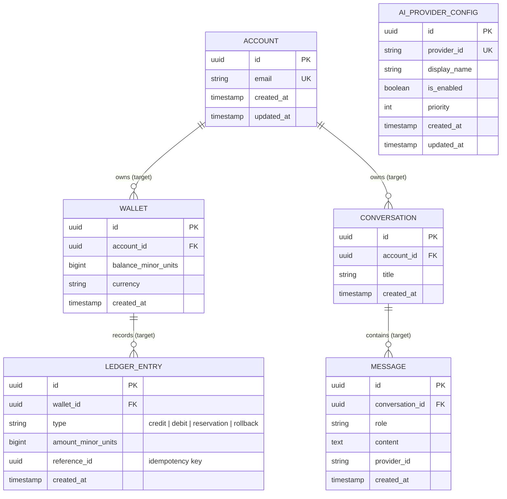

# Database Standards

Companion to `database-architecture.md` (ownership/consumption rules). This document covers conventions, diagrams, and operational strategy.

## ER diagram (current + target — clearly marked)

`ACCOUNT` corresponds to the currently-implemented `User` Prisma model — the rename to `Account` is a recommended-but-not-yet-made change, see `ddd-tactical-design.md` and `TECHNICAL_DEBT.md`.

## Naming standards

- **Tables:** `snake_case`, plural (`users`, `ai_provider_configs`) via Prisma's `@@map`. Model names in `schema.prisma` stay `PascalCase` singular (`User`, `AiProviderConfig`) — Prisma convention, keeps generated TS types idiomatic.
- **Columns:** `snake_case` in the database (via Prisma's default mapping from camelCase field names — no explicit `@map` needed per-field, Prisma handles it), `camelCase` in the Prisma schema/generated client.
- **Foreign keys:** `<singular_table>_id` (e.g. `wallet_id` on `ledger_entries`).
- **Indexes:** `idx_<table>_<column(s)>`; unique constraints `uq_<table>_<column(s)>` (Prisma generates its own default names — override with explicit `@@index(map: ...)`/`@@unique(map: ...)` when the default would be ambiguous across a growing schema).
- **Enums:** stored as Postgres native enums via Prisma `enum`, not free-text columns with app-level validation — the database should reject an invalid `LedgerEntry.type` even if the application layer has a bug.

## Migration strategy

- One migration per schema change, generated via `prisma migrate dev --name <descriptive-name>`, committed alongside the schema change in the same PR — never hand-edited SQL unless Prisma genuinely can't express the change (documented inline in the migration file's header comment if so).
- **Backward-compatible by default:** additive changes (new nullable column, new table) ship and deploy independently of application code. Destructive changes (drop column, rename, tighten a constraint) follow expand/contract: (1) expand — add the new shape alongside the old, (2) migrate application code to the new shape, (3) contract — a follow-up migration drops the old shape, only after confirming no code path still reads it.
- `prisma migrate deploy` (not `migrate dev`) runs in CI/production — it applies pending migrations without generating new ones or prompting, per Prisma's own recommended production flow.

## Versioning strategy

The schema has no separate version number — the migration history *is* the version (each environment's applied-migrations set is queryable via Prisma's `_prisma_migrations` table). This is intentionally simpler than a manual schema-version column: Prisma already tracks this correctly, and a parallel manual version number would just be a second source of truth that can drift.

## Index strategy

- Every foreign key column gets an index by default (Prisma does not do this automatically for relation scalar fields — add `@@index([fooId])` explicitly when a query will filter/join on it; not needed yet since no relations exist in the current schema).
- Every column used in a `WHERE`/`ORDER BY` in a use case's repository query gets evaluated for an index at the time that query is written — not added speculatively ahead of a real query, per "never optimize prematurely."
- `AiProviderConfig.providerId` and `Account.email` are already unique-indexed (via `@unique`), since both are looked up by that value, not by id, in their expected access patterns.

## Backup strategy (design — no production database exists yet)

- **Local dev:** no backup — `infra/docker/docker-compose.yml`'s Postgres volume is disposable by design (`docker compose down -v` is an accepted way to reset).
- **Production (target, once a database exists):** continuous WAL archiving + daily full snapshot, retained per whatever the hosting provider offers natively (most managed Postgres offerings — RDS, Cloud SQL, Neon, Supabase — provide this out of the box; prefer using the platform's native backup over a custom cron+pg_dump script unless self-hosting). Restore procedure and RPO/RTO targets are not defined yet — they depend on the hosting choice (`infra/README.md`'s open staging/production question) and should be defined together with that choice, not guessed independently.

## Prisma conventions

- Schema lives only in `packages/database/prisma/schema.prisma` — never a second schema file.
- Every model gets `createdAt`/`updatedAt` (via `@default(now())` / `@updatedAt`) even if not immediately queried — cheap to have, expensive to retrofit once rows exist without them.
- `packages/database`'s generated client is re-exported, never re-implemented — `apps/api`'s repositories import Prisma's generated types (`User`, etc.) from `@aifa/database`, never redefine their own shape for the same table.
- Soft-delete vs. hard-delete is undecided (no entity has a deletion requirement yet) — decide per-entity when the entity is actually implemented, don't apply a blanket policy speculatively.
